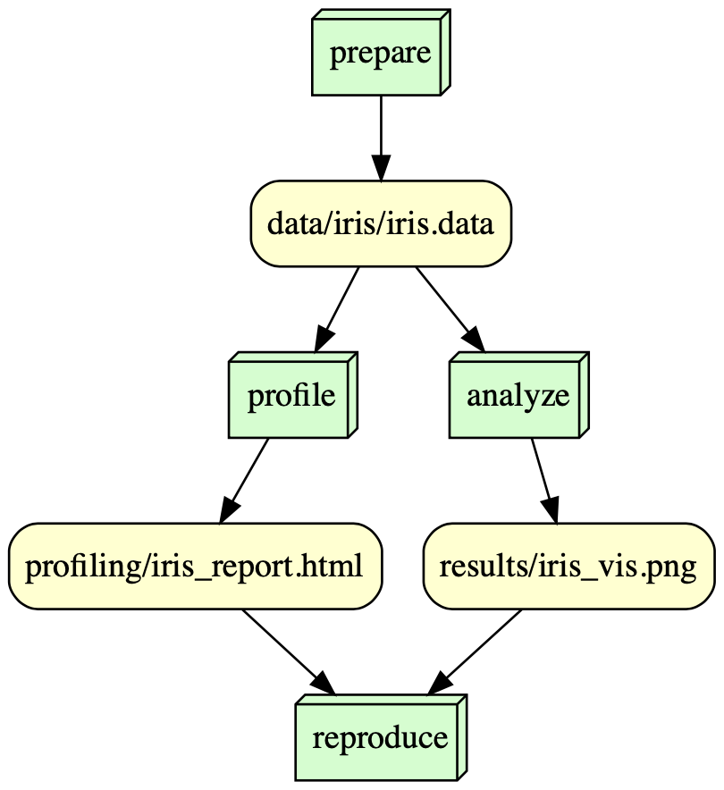

# Final Project for IS 477 

Caden Chenicek

## Overview

For my final project I have decided to analyze the famous Iris dataset from 1936. This data is widely known for being one of the first classification datasets to be published in literature. Now, almost a century later, the dataset is still put to good use in teaching statistics and machine learning. The dataset consists of 5 features. That being sepal length, sepal width, petal length, petal width, and the type of iris (all of the quantitative columns are measured in centimeters). Within the profiling folder there is an .html file that can be opened to reveal an in depth look at the data. This webpage allows for the user to compare two features from the dataset in order to determine their relation in real time. This element of the project is very user friendly, as there is no programming required and the UI is very simple to understand. Inside the results folder is a visualization that contains a scatter plot of sepal length on the x-axis and petal length on the y-axis. Further information on this analysis is detailed below.

## Analysis

The goal of this visualization was to create a public friendly scatter plot. When making this visualization I wanted to use as little python packages as I could, so as to not make reproduction difficult. The plot makes it easy to see how the dataset can be useful in running classification models, whether that be for machine learning, statistics, etc. Each point is colored depending on which type of iris it is, and a legend can be seen on the right hand side detailing this information. Looking at the plot, it becomes fairly obvious that the two features, sepal length and petal length, are strongly correlated and with each point colored based on its class, it also becomes easy to see how a ML algorithm might go about classification.

## Workflow

Below is the DAG for the Snakemake workflow

## Reproducing
### In order to accuratly reproduce these findings, please follow these steps:
    
    1. Set up a virtual enviroment that uses the requirements.txt in this repository.

    2. Ensure that your system or virtual machine matches the specifications listed in the environment.log file found in this repository.

    3. Run the Snakemake file in terminal:
    
        * Ensure that you are in your virtual environment
        * Ensure that you are in the correct directory
        * Run command "snakemake --cores 1 reproduce" in terminal
        * Ensure that you get the message: 'Hash matches on the Iris Dataset'

    This will ensure that the data files are the exact same version that was used in conducting these findings. This will also run the proper scripts to populate the data, profiling, and results folders.

## License

I went with the GNU General Public License v3.0 (GPL-3.0) for this project, as it is a very permissive license and allows for any user to modify, distribute, privatly use, or even pattent this software. I believe this to be the best fit for my project because it requires the user to disclose this source and for the same license to be used upon distribution.

## References

### [The Iris Dataset:](https://archive.ics.uci.edu/static/public/53/iris.zip)

    Fisher,R.A.. (1988). 
        Iris. UCI Machine Learning Repository.
        https://doi.org/10.24432/C56C76.
